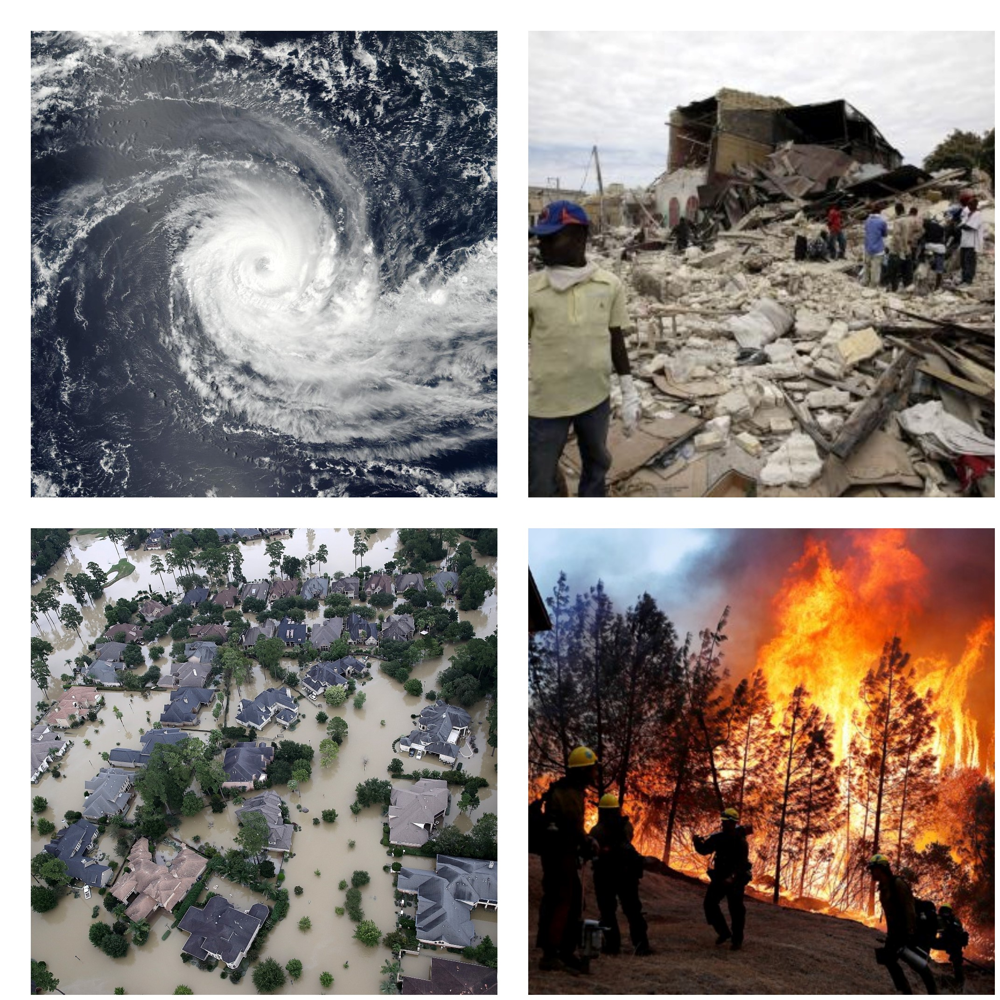
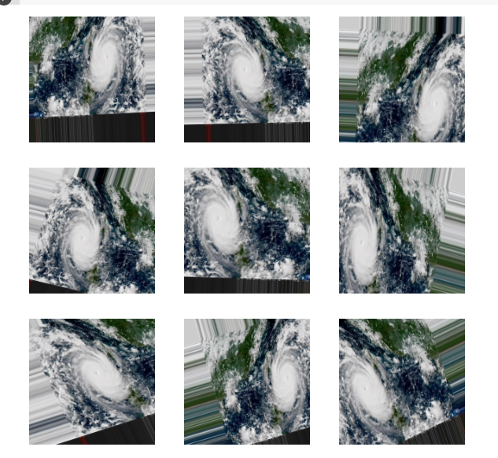

# Applied Deep Learning: Detecting Natural Disasters

## Introduction
This project will use deep learning algorithms to automatically detect natural disasters in images. Tensorflow, Pandas and Numpy python packages were used on create the finalized model. 

The natural disaster dataset contains four classes:  
- Cyclone  
- Earthquake  
- Flood  
- Wildfire  

This projects conducts experiments that will:  
- Help us fine-tune custom CNN from scratch based on the dataset 
- Use data augmentation to artificially create new training data, allowing the model to see new training data while training  
- Use callbacks to help fine tone the model  
- Train our model and obtain > 75% accuracy  

## Selection of Data
Non formated data set can be found here: https://www.kaggle.com/datasets/mikolajbabula/disaster-images-dataset-cnn-model  
Data consits of 900 images for each class (Cyclone, Earthquake, Food, Wildfire)

Images have been seperated for the following:  
- Train (360 images/class)
- Validation (180 images/class)
- Test (360 images/class)

### Data Augmentation
Image data augmentation is an important technique that can help to expand the size of the training dataset, without additional images. Data augmentation will artifically expand the size but creating modified versions of the originial images within the training dataset.  

data_augmentation = keras.Sequential([  
        layers.RandomFlip("horizontal"),  #range for random flip: 50%  
        layers.RandomRotation(0.1),  #range for random rotation: +/- 10%  
        layers.RandomZoom(0.2), #range for random zoom: +/- 20%  
]) 

## Methods
Tools:  
- NumPy, Pandas, and Tensorflow,  Keras for data analysis and inference  
- GitHub for hosting/version control  

Inference methods used with Tensorflow & Keras:  
- Sequential model  
- Features: ImageDataGenerator  
- Callbacks: ModelCheckpoint  

