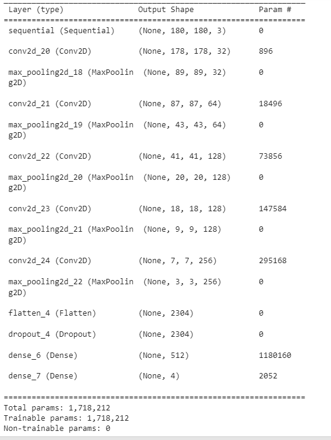
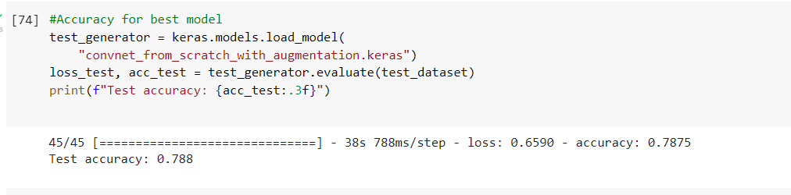
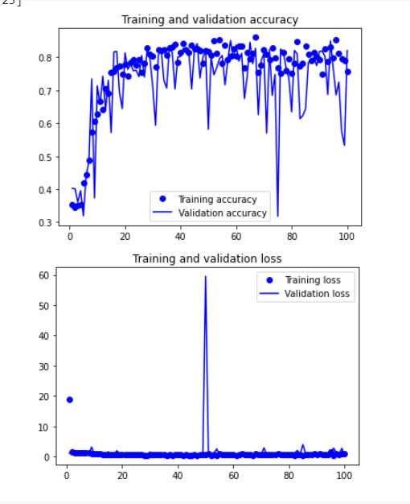
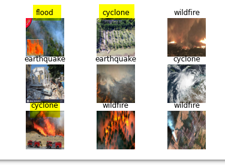

# Applied Deep Learning: Detecting Natural Disasters

## Introduction
This project will use deep learning algorithms to automatically detect natural disasters in images. Tensorflow, Pandas and Numpy python packages were used on create the finalized model. 

The natural disaster dataset contains four classes:  
- Cyclone  
- Earthquake  
- Flood  
- Wildfire  

This projects conducts experiments that will:  
- Help us fine-tune custom CNN from scratch based on the dataset 
- Use data augmentation to artificially create new training data, allowing the model to see new training data while training  
- Use callbacks to help fine tone the model  
- Train our model and obtain > 75% accuracy  

## Selection of Data
Non formated data set can be found here: https://www.kaggle.com/datasets/mikolajbabula/disaster-images-dataset-cnn-model  
Formatted data can be found on my Google Drive: https://drive.google.com/drive/folders/13eHRpxOIUN13Px_rLkFZOyW3tbL4MWBd?usp=sharing
Data consits of 900 images for each class (Cyclone, Earthquake, Food, Wildfire)

Images have been seperated for the following:  
- Train (360 images/class)
- Validation (180 images/class)
- Test (360 images/class)

### Data Augmentation
Image data augmentation is an important technique that can help to expand the size of the training dataset, without additional images. Data augmentation will artifically expand the size but creating modified versions of the originial images within the training dataset.  

data_augmentation = keras.Sequential([  
        layers.RandomFlip("horizontal"),  #range for random flip: 50%  
        layers.RandomRotation(0.1),  #range for random rotation: +/- 10%  
        layers.RandomZoom(0.2), #range for random zoom: +/- 20%  
]) 

## Methods
Tools:  
- NumPy, Pandas, and Tensorflow,  Keras for data analysis and inference  
- GitHub for hosting/version control  

Inference methods used with Tensorflow & Keras:  
- Sequential model  
- Features: ImageDataGenerator  
- Callbacks: ModelCheckpoint  

## Results
By using callsbacks, while training the model, the best model was able to be saved. This model then was used on the test dataset to determine the final accuracy. 

History callback is automatically applied to every model, allowing us to see metrics for each epoch. During training, this model ran for 100 epoch. The test and validation accuracy and losses can be seen below.   

As shown below, the model will now made predctions based upon the image. With an accuracy of 78%, you would expect 2-3 of the images to be missclasses (as highlighted).  

## Discussion
The purpose of this project was to determine if a custom CNN from scratch could achieve an accuracy close to other projects working with this dataset that used a pretrained model (i.e. VGG16). In this project, with a fine-tune VGG16 model, a testing accuracy of 95% was achieved. This is approximently a 19% increase in accuracy compared to the CNN built from scratch.  
Link to model project w/ VGG16:  https://pyimagesearch.com/2019/11/11/detecting-natural-disasters-with-keras-and-deep-learning/  

## Summary
While creating a CNN from scratch, using fine turing parameters and data augmentation, I was able to achieve a training accuracy of ~80% and a testing accuracy of ~78%. This accuracy satified the inital requirement of achieving at least 75% accuracy. With more analysis of the actual prediction results compared to expected, the model could be fine tuned to increase testing accuracy. 

